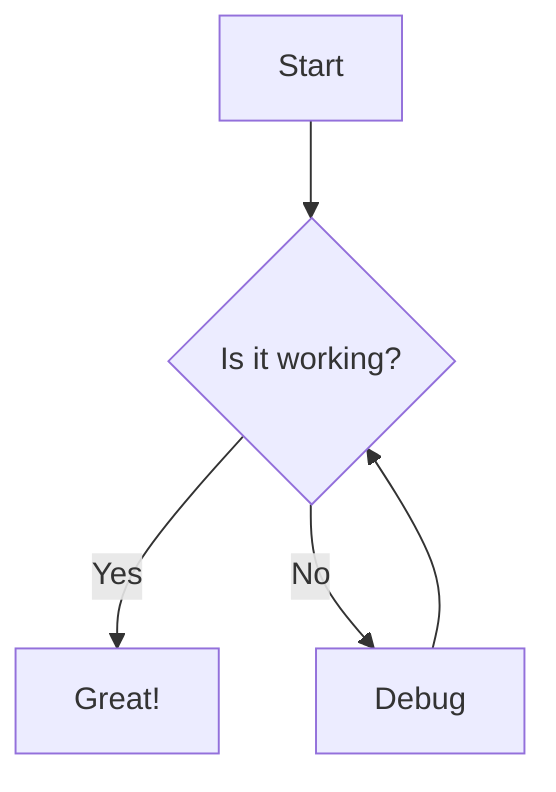

## はじめに

https://astro.build/blog/astro-550/

Astro5.5が2025/03/13にリリースされました。今回のリリースでは`excludeLangs`オプションがmarkdownの設定の中に生えました。
このオプションにより、今までは少し面倒だったMermaidが扱いやすくなったとのことなので試してみました。
ちょうど自分のAstroで作ったブログにMermaidを入れたいなと思っていたのでタイミングが良かったです。

こちらのレポジトリに今回のソースコードが入っています。

https://github.com/wagomu-no-sunaba/etude-astro-mermaid

## セットアップ

`pnpm create astro@latest`などでバージョン5.5以上のAstroを準備してください。

必要なステップは以下２つです。

- `rehype-mermaid`のインストール
- `npx playwright install`の実行

## やってみよう

以下のような`src/pages/index.md`を用意します。
`````
# Astro + mermaid

````

````


````
```js
console.log(1);
```
````

```js
console.log(1);
```
`````

この状態でページを確認するとこのようになります。


Mermaidを試す前にまずは、今回のリリースで追加された`excludeLangs`を試してみましょう

```diff
 // @ts-check
 import { defineConfig } from 'astro/config';

 // https://astro.build/config
-export default defineConfig({})
+export default defineConfig({
+  markdown: {
+    syntaxHighlight: {
+      type: 'shiki',
+      excludeLangs: ['mermaid', 'js'],
+    },
+  }
+});

```
`astro.config.js`を以下のように修正して、ページを確認するとこのようになっているはずです。


`excludeLangs`設定前

`excludeLangs`設定後


設定後も`<pre>`タグと`<code>`タグで囲われますが、スタイリングがされないようです。

`excludeLangs`オプションの挙動を確認したところで、rehypePluginを設定してみましょう。

```diff
 // @ts-check
 import { defineConfig } from 'astro/config';
+import rehypeMermaid from 'rehype-mermaid';
 
 // https://astro.build/config
 export default defineConfig({
   markdown: {
     syntaxHighlight: {
       type: 'shiki',
       excludeLangs: ['mermaid', 'js'],
     },
+    rehypePlugins: [rehypeMermaid],
   }
 });
```
`astro.config.js`を以下のように修正して、ページを確認するとこのようになっているはずです。


もし、`playwright`が入っていないのであればこのようなエラーが表示されます。


```
22:59:46 [ERROR] Failed to parse Markdown file "/home/beige/dev/github.com/wagomu-no-sunaba/etude-astro-mermaid/src/pages/index.md":
browserType.launch: Executable doesn't exist at /home/beige/.cache/ms-playwright/chromium_headless_shell-1161/chrome-linux/headless_shell
╔═════════════════════════════════════════════════════════════════════════╗
║ Looks like Playwright Test or Playwright was just installed or updated. ║
║ Please run the following command to download new browsers:              ║
║                                                                         ║
║     npx playwright install                                              ║
║                                                                         ║
║ <3 Playwright Team                                                      ║
╚═════════════════════════════════════════════════════════════════════════╝
  Stack trace:
    at /home/beige/dev/github.com/wagomu-no-sunaba/etude-astro-mermaid/node_modules/mermaid-isomorphic/dist/mermaid-isomorphic.js:93:39
    [...] See full stack trace in the browser, or rerun with --verbose.
browserType.launch: Executable doesn't exist at /home/beige/.cache/ms-playwright/chromium_headless_shell-1161/chrome-linux/headless_shell
╔═════════════════════════════════════════════════════════════════════════╗
║ Looks like Playwright Test or Playwright was just installed or updated. ║
║ Please run the following command to download new browsers:              ║
║                                                                         ║
║     npx playwright install                                              ║
║                                                                         ║
║ <3 Playwright Team                                                      ║
╚═════════════════════════════════════════════════════════════════════════╝
    at getBrowser (/home/beige/dev/github.com/wagomu-no-sunaba/etude-astro-mermaid/node_modules/mermaid-isomorphic/dist/mermaid-isomorphic.js:93:39)
    at /home/beige/dev/github.com/wagomu-no-sunaba/etude-astro-mermaid/node_modules/mermaid-isomorphic/dist/mermaid-isomorphic.js:124:30
    at /home/beige/dev/github.com/wagomu-no-sunaba/etude-astro-mermaid/node_modules/rehype-mermaid/dist/rehype-mermaid.js:261:13
    at wrapped (/home/beige/dev/github.com/wagomu-no-sunaba/etude-astro-mermaid/node_modules/trough/lib/index.js:160:27)
    at next (/home/beige/dev/github.com/wagomu-no-sunaba/etude-astro-mermaid/node_modules/trough/lib/index.js:86:23)
    at done (/home/beige/dev/github.com/wagomu-no-sunaba/etude-astro-mermaid/node_modules/trough/lib/index.js:194:7)
    at then (/home/beige/dev/github.com/wagomu-no-sunaba/etude-astro-mermaid/node_modules/trough/lib/index.js:204:5) {
  name: 'Error'
}
```

言われた通り、playwrightをインストールしましょう。今回はbunを使っているので`bunx playwright install`を実行します。 

```shell
> bunx playwright install

Removing unused browser at /home/beige/.cache/ms-playwright/chromium-1148
Removing unused browser at /home/beige/.cache/ms-playwright/chromium_headless_shell-1148
Removing unused browser at /home/beige/.cache/ms-playwright/ffmpeg-1010
Downloading Chromium 134.0.6998.35 (playwright build v1161) from https://cdn.playwright.dev/dbazure/download/playwright/builds/chromium/1161/chromium-linux.zip
164.9 MiB [====================] 100% 0.0s
Chromium 134.0.6998.35 (playwright build v1161) downloaded to /home/beige/.cache/ms-playwright/chromium-1161
Downloading Chromium Headless Shell 134.0.6998.35 (playwright build v1161) from https://cdn.playwright.dev/dbazure/download/playwright/builds/chromium/1161/chromium-headless-shell-linux.zip
100.9 MiB [====================] 100% 0.0s
Chromium Headless Shell 134.0.6998.35 (playwright build v1161) downloaded to /home/beige/.cache/ms-playwright/chromium_headless_shell-1161
Downloading Firefox 135.0 (playwright build v1475) from https://cdn.playwright.dev/dbazure/download/playwright/builds/firefox/1475/firefox-ubuntu-22.04.zip
90.6 MiB [====================] 100% 0.0s
Firefox 135.0 (playwright build v1475) downloaded to /home/beige/.cache/ms-playwright/firefox-1475
Downloading Webkit 18.4 (playwright build v2140) from https://cdn.playwright.dev/dbazure/download/playwright/builds/webkit/2140/webkit-ubuntu-22.04.zip
92.3 MiB [====================] 100% 0.0s
Webkit 18.4 (playwright build v2140) downloaded to /home/beige/.cache/ms-playwright/webkit-2140
Downloading FFMPEG playwright build v1011 from https://cdn.playwright.dev/dbazure/download/playwright/builds/ffmpeg/1011/ffmpeg-linux.zip
2.3 MiB [====================] 100% 0.0s
FFMPEG playwright build v1011 downloaded to /home/beige/.cache/ms-playwright/ffmpeg-1011
Playwright Host validation warning:
╔══════════════════════════════════════════════════════╗
║ Host system is missing dependencies to run browsers. ║
║ Missing libraries:                                   ║
║     libgtk-4.so.1                                    ║
║     libevent-2.1.so.7                                ║
║     libgstcodecparsers-1.0.so.0                      ║
║     libavif.so.13                                    ║
╚══════════════════════════════════════════════════════╝
    at validateDependenciesLinux (/home/beige/dev/github.com/wagomu-no-sunaba/etude-astro-mermaid/node_modules/playwright-core/lib/server/registry/dependencies.js:216:9)
    at process.processTicksAndRejections (node:internal/process/task_queues:95:5)
    at async Registry._validateHostRequirements (/home/beige/dev/github.com/wagomu-no-sunaba/etude-astro-mermaid/node_modules/playwright-core/lib/server/registry/index.js:859:52)
    at async Registry._validateHostRequirementsForExecutableIfNeeded (/home/beige/dev/github.com/wagomu-no-sunaba/etude-astro-mermaid/node_modules/playwright-core/lib/server/registry/index.js:957:7)
    at async Registry.validateHostRequirementsForExecutablesIfNeeded (/home/beige/dev/github.com/wagomu-no-sunaba/etude-astro-mermaid/node_modules/playwright-core/lib/server/registry/index.js:946:43)
    at async t.<anonymous> (/home/beige/dev/github.com/wagomu-no-sunaba/etude-astro-mermaid/node_modules/playwright-core/lib/cli/program.js:122:7)

```

再度ページを確認するとSVG画像として表示されます。

buildした内容を確認するとSVGで出力されていることが確認できます。

```sh
> bun run build
$ astro build
23:40:07 [vite] Re-optimizing dependencies because lockfile has changed
23:40:07 [content] Syncing content
23:40:07 [content] Synced content
23:40:07 [types] Generated 169ms
23:40:07 [build] output: "static"
23:40:07 [build] mode: "static"
23:40:07 [build] directory: /home/beige/dev/github.com/wagomu-no-sunaba/etude-astro-mermaid/dist/
23:40:07 [build] Collecting build info...
23:40:07 [build] ✓ Completed in 184ms.
23:40:07 [build] Building static entrypoints...
23:40:09 [vite] ✓ built in 1.54s
23:40:09 [build] ✓ Completed in 1.58s.

 generating static routes
23:40:09 ▶ src/pages/index.md
23:40:09   └─ /index.html (+6ms)
23:40:09 ✓ Completed in 12ms.

23:40:09 [build] 1 page(s) built in 1.79s
23:40:09 [build] Complete!
```

```html
<!DOCTYPE html><meta charset="utf-8"><h1 id="astro--mermaid">Astro + mermaid</h1>
<pre class="astro-code github-dark" style="background-color:#24292e;color:#e1e4e8; overflow-x: auto;" tabindex="0" data-language="plaintext"><code><span class="line"><span>```mermaid</span></span>
<span class="line"><span>graph TD</span></span>
<span class="line"><span>    A[Start] --> B{Is it working?}</span></span>
<span class="line"><span>    B -->|Yes| C[Great!]</span></span>
<span class="line"><span>    B -->|No| D[Debug]</span></span>
<span class="line"><span>    D --> B</span></span>
<span class="line"><span>```</span></span></code></pre>
<svg aria-roledescription="flowchart-v2" role="graphics-document document" viewBox="0 0 277.625 395.375" style="max-width: 277.625px;" class="flowchart" xmlns="http://www.w3.org/2000/svg" width="100%" id="mermaid-0"><style>#mermaid-0{font-family:arial,sans-serif;font-size:16px;fill:#333;}@keyframes edge-animation-frame{from{stroke-dashoffset:0;}}@keyframes dash{to{stroke-dashoffset:0;}}#mermaid-0 .edge-animation-slow{stroke-dasharray:9,5!important;stroke-dashoffset:900;animation:dash 50s linear infinite;stroke-linecap:round;}#mermaid-0 .edge-animation-fast{stroke-dasharray:9,5!important;stroke-dashoffset:900;animation:dash 20s linear infinite;stroke-linecap:round;}#mermaid-0
.error-icon{fill:#552222;}#mermaid-0 .error-text{fill:#552222;stroke:#552222;}#mermaid-0 .edge-thickness-normal{stroke-width:1px;}#mermaid-0 .edge-thickness-thick{stroke-width:3.5px;}#mermaid-0 .edge-pattern-solid{stroke-dasharray:0;}#mermaid-0 .edge-thickness-invisible{stroke-width:0;fill:none;}#mermaid-0 .edge-pattern-dashed{stroke-dasharray:3;}#mermaid-0 .edge-pattern-dotted{stroke-dasharray:2;}#mermaid-0 .marker{fill:#333333;stroke:#333333;}#mermaid-0 .marker.cross{stroke:#333333;}#mermaid-0 svg{font-family:arial,sans-serif;font-size:16px;}#mermaid-0 p{margin:0;}#mermaid-0 .label{font-family:arial,sans-serif;color:#333;}#mermaid-0 .cluster-label text{fill:#333;}#mermaid-0 .cluster-label span{color:#333;}#mermaid-0 .cluster-label span p{background-color:transparent;}#mermaid-0 .label text,#mermaid-0 span{fill:#333;color:#333;}#mermaid-0 .node rect,#mermaid-0 .node circle,#mermaid-0 .node ellipse,#mermaid-0 .node polygon,#mermaid-0 .node path{fill:#ECECFF;stroke:#9370DB;stroke-width:1px;}#mermaid-0 .rough-node .label text,#mermaid-0 .node .label text,#mermaid-0 .image-shape .label,#mermaid-0 .icon-shape .label{text-anchor:middle;}#mermaid-0 .node .katex path{fill:#000;stroke:#000;stroke-width:1px;}#mermaid-0 .rough-node .label,#mermaid-0 .node .label,#mermaid-0 .image-shape .label,#mermaid-0 .icon-shape .label{text-align:center;}#mermaid-0 .node.clickable{cursor:pointer;}#mermaid-0 .root .anchor path{fill:#333333!important;stroke-width:0;stroke:#333333;}#mermaid-0 .arrowheadPath{fill:#333333;}#mermaid-0 .edgePath .path{stroke:#333333;stroke-width:2.0px;}#mermaid-0 .flowchart-link{stroke:#333333;fill:none;}#mermaid-0 .edgeLabel{background-color:rgba(232,232,232, 0.8);text-align:center;}#mermaid-0 .edgeLabel p{background-color:rgba(232,232,232, 0.8);}#mermaid-0 .edgeLabel rect{opacity:0.5;background-color:rgba(232,232,232, 0.8);fill:rgba(232,232,232, 0.8);}#mermaid-0 .labelBkg{background-color:rgba(232, 232, 232, 0.5);}#mermaid-0 .cluster rect{fill:#ffffde;stroke:#aaaa33;stroke-width:1px;}#mermaid-0 .cluster text{fill:#333;}#mermaid-0 .cluster span{color:#333;}#mermaid-0 div.mermaidTooltip{position:absolute;text-align:center;max-width:200px;padding:2px;font-family:arial,sans-serif;font-size:12px;background:hsl(80, 100%, 96.2745098039%);border:1px solid #aaaa33;border-radius:2px;pointer-events:none;z-index:100;}#mermaid-0 .flowchartTitleText{text-anchor:middle;font-size:18px;fill:#333;}#mermaid-0 rect.text{fill:none;stroke-width:0;}#mermaid-0 .icon-shape,#mermaid-0 .image-shape{background-color:rgba(232,232,232, 0.8);text-align:center;}#mermaid-0 .icon-shape p,#mermaid-0 .image-shape p{background-color:rgba(232,232,232, 0.8);padding:2px;}#mermaid-0 .icon-shape rect,#mermaid-0 .image-shape rect{opacity:0.5;background-color:rgba(232,232,232, 0.8);fill:rgba(232,232,232, 0.8);}#mermaid-0 :root{--mermaid-font-family:arial,sans-serif;}</style><g><marker orient="auto" markerHeight="8" markerWidth="8" markerUnits="userSpaceOnUse" refY="5" refX="5" viewBox="0 0 10 10" class="marker flowchart-v2" id="mermaid-0_flowchart-v2-pointEnd"><path style="stroke-width: 1; stroke-dasharray: 1, 0;" class="arrowMarkerPath" d="M 0 0 L 10 5 L 0 10 z"></path></marker><marker orient="auto" markerHeight="8" markerWidth="8" markerUnits="userSpaceOnUse" refY="5" refX="4.5" viewBox="0 0 10 10" class="marker flowchart-v2" id="mermaid-0_flowchart-v2-pointStart"><path style="stroke-width: 1;
stroke-dasharray: 1, 0;" class="arrowMarkerPath" d="M 0 5 L 10 10 L 10 0 z"></path></marker><marker orient="auto" markerHeight="11" markerWidth="11" markerUnits="userSpaceOnUse" refY="5" refX="11" viewBox="0 0 10 10" class="marker flowchart-v2" id="mermaid-0_flowchart-v2-circleEnd"><circle style="stroke-width: 1; stroke-dasharray: 1, 0;" class="arrowMarkerPath" r="5" cy="5" cx="5"></circle></marker><marker orient="auto" markerHeight="11" markerWidth="11" markerUnits="userSpaceOnUse" refY="5" refX="-1" viewBox="0 0 10 10" class="marker flowchart-v2" id="mermaid-0_flowchart-v2-circleStart"><circle style="stroke-width: 1; stroke-dasharray: 1, 0;" class="arrowMarkerPath" r="5" cy="5" cx="5"></circle></marker><marker orient="auto" markerHeight="11" markerWidth="11" markerUnits="userSpaceOnUse" refY="5.2" refX="12" viewBox="0 0 11 11" class="marker
cross flowchart-v2" id="mermaid-0_flowchart-v2-crossEnd"><path style="stroke-width: 2; stroke-dasharray: 1, 0;" class="arrowMarkerPath" d="M 1,1 l 9,9 M 10,1 l -9,9"></path></marker><marker orient="auto" markerHeight="11" markerWidth="11" markerUnits="userSpaceOnUse" refY="5.2" refX="-1" viewBox="0 0 11 11" class="marker cross flowchart-v2" id="mermaid-0_flowchart-v2-crossStart"><path style="stroke-width: 2; stroke-dasharray: 1, 0;" class="arrowMarkerPath" d="M 1,1 l 9,9 M 10,1 l -9,9"></path></marker><g class="root"><g class="clusters"></g><g class="edgePaths"><path marker-end="url(#mermaid-0_flowchart-v2-pointEnd)" style="" class="edge-thickness-normal edge-pattern-solid edge-thickness-normal edge-pattern-solid flowchart-link" id="L_A_B_0" d="M159.781,62L159.781,66.167C159.781,70.333,159.781,78.667,159.852,86.417C159.922,94.167,160.062,101.334,160.133,104.917L160.203,108.501"></path><path marker-end="url(#mermaid-0_flowchart-v2-pointEnd)" style="" class="edge-thickness-normal edge-pattern-solid edge-thickness-normal edge-pattern-solid flowchart-link" id="L_B_C_0" d="M125.39,224.984L114.531,236.882C103.671,248.781,81.953,272.578,71.094,289.976C60.234,307.375,60.234,318.375,60.234,323.875L60.234,329.375"></path><path marker-end="url(#mermaid-0_flowchart-v2-pointEnd)" style="" class="edge-thickness-normal edge-pattern-solid edge-thickness-normal edge-pattern-solid flowchart-link" id="L_B_D_0" d="M160.281,259.875L160.198,265.958C160.115,272.042,159.948,284.208,164.846,295.958C169.744,307.707,179.706,319.039,184.687,324.705L189.669,330.371"></path><path marker-end="url(#mermaid-0_flowchart-v2-pointEnd)" style="" class="edge-thickness-normal edge-pattern-solid edge-thickness-normal edge-pattern-solid flowchart-link" id="L_D_B_0" d="M222.423,333.375L223.879,327.208C225.335,321.042,228.248,308.708,223.066,292.204C217.884,275.701,204.608,255.026,197.97,244.689L191.332,234.352"></path></g><g class="edgeLabels"><g class="edgeLabel"><g transform="translate(0, 0)" class="label"><foreignObject height="0" width="0"><div style="display: table-cell; white-space: nowrap; line-height: 1.5; max-width: 200px; text-align: center;" class="labelBkg" xmlns="http://www.w3.org/1999/xhtml"><span class="edgeLabel"></span></div></foreignObject></g></g><g transform="translate(60.234375, 296.375)" class="edgeLabel"><g transform="translate(-13.0546875, -12)" class="label"><foreignObject height="24" width="26.109375"><div style="display: table-cell; white-space: nowrap; line-height: 1.5; max-width: 200px; text-align: center;" class="labelBkg" xmlns="http://www.w3.org/1999/xhtml"><span class="edgeLabel"><p>Yes</p></span></div></foreignObject></g></g><g transform="translate(159.78125, 296.375)" class="edgeLabel"><g transform="translate(-10.2265625, -12)" class="label"><foreignObject height="24" width="20.453125"><div style="display: table-cell; white-space: nowrap; line-height: 1.5; max-width: 200px; text-align: center;" class="labelBkg" xmlns="http://www.w3.org/1999/xhtml"><span class="edgeLabel"><p>No</p></span></div></foreignObject></g></g><g class="edgeLabel"><g transform="translate(0, 0)" class="label"><foreignObject height="0" width="0"><div style="display: table-cell; white-space: nowrap; line-height: 1.5; max-width: 200px; text-align: center;" class="labelBkg" xmlns="http://www.w3.org/1999/xhtml"><span class="edgeLabel"></span></div></foreignObject></g></g></g><g class="nodes"><g transform="translate(159.78125, 35)" id="flowchart-A-0" class="node default"><rect height="54" width="93.796875" y="-27" x="-46.8984375" style="" class="basic label-container"></rect><g transform="translate(-16.8984375, -12)" style="" class="label"><rect></rect><foreignObject height="24" width="33.796875"><div style="display: table-cell; white-space: nowrap; line-height: 1.5; max-width: 200px; text-align: center;" xmlns="http://www.w3.org/1999/xhtml"><span class="nodeLabel"><p>Start</p></span></div></foreignObject></g></g><g transform="translate(159.78125, 185.6875)" id="flowchart-B-1" class="node default"><polygon transform="translate(-73.6875,73.6875)" class="label-container"
points="73.6875,0 147.375,-73.6875 73.6875,-147.375 0,-73.6875"></polygon><g transform="translate(-46.6875, -12)" style="" class="label"><rect></rect><foreignObject height="24" width="93.375"><div style="display: table-cell; white-space: nowrap; line-height: 1.5; max-width: 200px; text-align: center;" xmlns="http://www.w3.org/1999/xhtml"><span class="nodeLabel"><p>Is it working?</p></span></div></foreignObject></g></g><g transform="translate(60.234375, 360.375)" id="flowchart-C-3" class="node default"><rect
height="54" width="104.46875" y="-27" x="-52.234375" style="" class="basic label-container"></rect><g transform="translate(-22.234375, -12)" style="" class="label"><rect></rect><foreignObject height="24" width="44.46875"><div style="display: table-cell; white-space: nowrap; line-height: 1.5; max-width: 200px; text-align: center;" xmlns="http://www.w3.org/1999/xhtml"><span class="nodeLabel"><p>Great!</p></span></div></foreignObject></g></g><g transform="translate(216.046875, 360.375)" id="flowchart-D-5" class="node default"><rect height="54" width="107.15625" y="-27" x="-53.578125" style="" class="basic label-container"></rect><g transform="translate(-23.578125, -12)" style="" class="label"><rect></rect><foreignObject height="24" width="47.15625"><div style="display: table-cell; white-space: nowrap; line-height: 1.5; max-width: 200px; text-align: center;" xmlns="http://www.w3.org/1999/xhtml"><span class="nodeLabel"><p>Debug</p></span></div></foreignObject></g></g></g></g></g></svg>
<pre class="astro-code github-dark" style="background-color:#24292e;color:#e1e4e8; overflow-x: auto;" tabindex="0" data-language="plaintext"><code><span class="line"><span>```js</span></span>
<span class="line"><span>console.log(1);</span></span>
<span class="line"><span>```</span></span></code></pre>
<pre><code class="language-js">console.log(1);
</code></pre>
```

余談ですが、mdをそのままビルドしたhtmlには`<head>`や`<body>`タグが付かないんですね。

## おわりに

頑張らなくてもMermaidを使えるようになりました。
