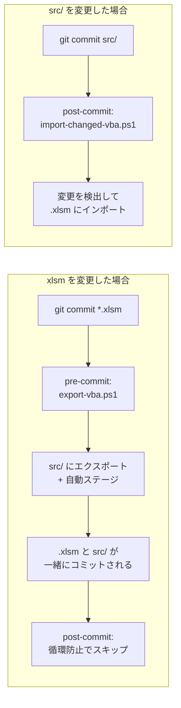

## はじめに

Excel VBA の開発をやっていると、ソースコード管理の壁にぶつかります。

個人的に使っているExcel マクロなら、少々壊れても問題ありませんが、仕事となるとそうはいきません。
そこで、gitのhookでコミット時にソースコードをエクスポートさせたらいいんじゃないか？と思いつき、試してみたところ上手くいったのでシェアします。

サンプルレポジトリはこちらです。

https://github.com/staticWagomU/xlsm-vba-git

## 仕組みの全体像

`.xlsm` をコミットすると VBA ソースが自動エクスポートされて、`src/` の変更をコミットすると `.xlsm` に自動インポートされます。



使うツールは3つです。

- [lefthook](https://github.com/evilmartians/lefthook)
    - Git フックを YAML で管理できるツール。pre-commit / post-commit / post-checkout / post-merge でスクリプトを呼ぶのに使います。
- PowerShell 7+
    - Excel COM オートメーションでワークブックを操作する
- Excel COM
    - VBA プロジェクトのコンポーネントをファイルにエクスポート/インポートする API

https://github.com/evilmartians/lefthook

## 前提条件

- Windows
- Excel デスクトップ版
- PowerShell（`pwsh` コマンドが使えること）
- Git
- lefthook

## セットアップ

### 1. lefthook のインストール

```powershell
winget install --id evilmartians.lefthook
```

または [Releases ページ](https://github.com/evilmartians/lefthook/releases) からバイナリを直接ダウンロードしてもOKです。

### 2. リポジトリにファイルを配置する

このリポジトリの以下のファイルをプロジェクトにコピーします。

```
your-project/
├── scripts/
│   ├── export-vba.ps1          ← VBA エクスポート（pre-commit で自動実行）
│   ├── import-vba.ps1          ← VBA インポート（ソース → Excel に書き戻す）
│   └── import-changed-vba.ps1  ← 変更検出 + インポート（post-commit 等で自動実行）
├── lefthook.yml                ← Git フックの設定
├── .gitignore
└── .gitattributes              ← Shift-JIS の diff 表示対応
```

### 3. lefthook を有効にする

```powershell
cd your-project
git init
lefthook install
```

### 4. Excel のトラスト センターを設定する

PowerShell から Excel の VBA プロジェクトにアクセスするには、Excel 側で許可が必要になります。

1. Excel を開く
2. ファイル → オプション → トラスト センター → トラスト センターの設定
3. 左メニューから マクロの設定 を選択
4. 「VBA プロジェクト オブジェクト モデルへのアクセスを信頼する」 にチェックを入れる
5. OK で閉じる

この設定をしないと `export-vba.ps1` が `programmatic access` エラーで失敗します。
セキュリティ的に気になる人もいるかもしれませんが、自分の開発マシンでの設定なので、リスクは限定的だと思っています。

### 5. 動作確認

```powershell
# .xlsm ファイルを Git に追加してコミットしてみる
git add MyWorkbook.xlsm
git commit -m "test: VBA エクスポートの動作確認"
```

コミット時に lefthook が `export-vba.ps1` を実行して、`src/MyWorkbook/` ディレクトリに VBA ソースファイルが生成されます。エクスポート後に `git add src/` が自動実行されるので、生成されたファイルはコミットに含まれるという算段です。

## 使い方

### xlsm を変更した場合（自動エクスポート）

普通にコミットするだけです。`.xlsm` ファイルがステージされていると lefthook が自動でエクスポートしてくれます。

```powershell
git add MyWorkbook.xlsm
git commit -m "feat: 売上計算ロジックを修正"
# → pre-commit: export-vba.ps1 が実行される
# → src/MyWorkbook/*.bas, *.cls が自動生成・ステージされる
# → .xlsm と src/ が一緒にコミットされる
# → post-commit: 循環防止マーカーにより import はスキップ
```

### src/ を変更した場合（自動インポート）

VBA ソースファイルを直接編集してコミットすると、post-commit で自動的に `.xlsm` に書き戻されます。

```powershell
# テキストエディタで src/ のファイルを編集
git add src/MyWorkbook/Module1.bas
git commit -m "fix: エラーハンドリングを修正"
# → post-commit: import-changed-vba.ps1 が実行される
# → git diff で src/ の変更を検出
# → 対応する .xlsm にインポートされる
```

ブランチの切り替え（`git checkout`）やマージ（`git merge`）でも同様に自動インポートが走ります。

### xlsm と src/ を同時にステージした場合

xlsm が正として扱われます。pre-commit で xlsm からエクスポートが行われます。

### 手動エクスポート

もちろん、直接スクリプトを実行するのもいいでしょう。

```powershell
pwsh scripts/export-vba.ps1 MyWorkbook.xlsm
```

複数ファイルにも対応しています。

```powershell
pwsh scripts/export-vba.ps1 Book1.xlsm Book2.xlsm
```

### 手動インポート

インポートも直接できます。
`src/` のファイルを直接ワークブックに反映したいときはこうです。

```powershell
pwsh scripts/import-vba.ps1 MyWorkbook.xlsm
```

> 注意: インポートはワークブックを上書き保存します。実行前にバックアップを取ることをおすすめです。

## 仕組みの詳細

### ディレクトリ構造

エクスポートすると以下のような構造になります。

```
your-project/
├── MyWorkbook.xlsm          ← Excel ファイル（バイナリ）
├── src/
│   └── MyWorkbook/           ← ブック名のディレクトリ
│       ├── ThisWorkbook.cls  ← ドキュメントモジュール
│       ├── Sheet1.cls        ← シートモジュール（コードがある場合のみ）
│       ├── Module1.bas       ← 標準モジュール
│       └── UserForm1.frm    ← ユーザーフォーム
├── scripts/
│   ├── export-vba.ps1
│   ├── import-vba.ps1
│   └── import-changed-vba.ps1
└── ...
```

ブックごとに `src/<ブック名>/` にまとまるので、1つのリポジトリで複数のワークブックを管理できます。

### VBA コンポーネントの種類と処理方法

VBA には4種類のコンポーネントがあって、それぞれ扱い方が違います。

| Type | 拡張子 | 説明 | エクスポート | インポート |
|------|--------|------|-------------|-----------|
| 1 | `.bas` | 標準モジュール | `Export` | 削除 → `Import` |
| 2 | `.cls` | クラスモジュール | `Export` | 削除 → `Import` |
| 3 | `.frm` | ユーザーフォーム | `Export` | 削除 → `Import` |
| 100 | `.cls` | ドキュメントモジュール | `Export`（コードありのみ） | `DeleteLines` → `AddFromString` |

ポイントは Type 100（ドキュメントモジュール） の扱いです。`ThisWorkbook` や `Sheet1` などは Excel が管理しているオブジェクトなので、削除して再インポートすることができません。代わりに、既存のコードを消してから新しいコードを注入する方法で差し替えています。

### 循環防止の仕組み

xlsm をコミットすると pre-commit でエクスポートが走り、src/ が変更されます。そのまま post-commit でインポートが走ると、エクスポートしたばかりの内容を再インポートしてしまいます。

これを防ぐために、`export-vba.ps1` はエクスポート成功時に `.git/vba-exported` というマーカーファイルを作成します。`import-changed-vba.ps1` はこのマーカーを見つけるとインポートをスキップし、マーカーを削除します。

## エンコーディングの話

Excel の VBA エクスポートは Shift-JIS（コードページ 932） でファイルを出力します。これは Excel/VBA の仕様で変更できません。

何もしないと `git diff` で日本語が文字化けしますが、`.gitattributes` で対応できます。

```gitattributes
*.bas diff working-tree-encoding=Shift_JIS
*.cls diff working-tree-encoding=Shift_JIS
```

この設定を入れておけば、`git diff` で日本語のコメントや文字列リテラルが正しく表示されます。

## lefthook.yml の解説

```yaml
pre-commit:
  commands:
    export-vba:
      glob: "*.xlsm"
      run: pwsh -File scripts/export-vba.ps1 {staged_files}
      stage_fixed: true

post-commit:
  commands:
    import-vba:
      run: pwsh -File scripts/import-changed-vba.ps1

post-checkout:
  commands:
    import-vba:
      run: pwsh -File scripts/import-changed-vba.ps1

post-merge:
  commands:
    import-vba:
      run: pwsh -File scripts/import-changed-vba.ps1
```

### pre-commit（エクスポート）

- `glob: "*.xlsm"` — `.xlsm` ファイルがステージされているときだけフックを実行する
- `{staged_files}` — lefthook がステージされたファイルのパスに展開してくれるテンプレート変数
- `stage_fixed: true` — フック実行中に変更されたステージ済みファイルを自動的に再ステージします
- スクリプト内でも `git add src/` を実行するので、新規ファイル（untracked）も確実にステージされます

### post-commit / post-checkout / post-merge（インポート）

- `{files}` テンプレートはこれらのフックでは使えないため、スクリプト内で `git diff HEAD~1 HEAD -- "src/"` を使って変更ファイルを自動検出します
- 循環防止マーカー（`.git/vba-exported`）がある場合はスキップします


## おわりに

この開発はあくまで、ローカルでの話です。
Githubでは1ファイル100MB未満という制限があり、すぐにxlsmファイルが上限にひっかかってしまいます。そのため、社内の共有サーバーで管理するなど別の仕組みが必要かもしれません。

いい案が思いついたらまた記事にしようと思います。

